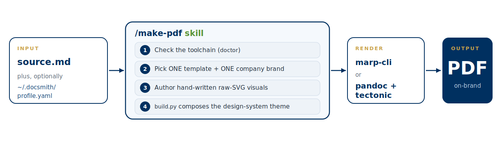
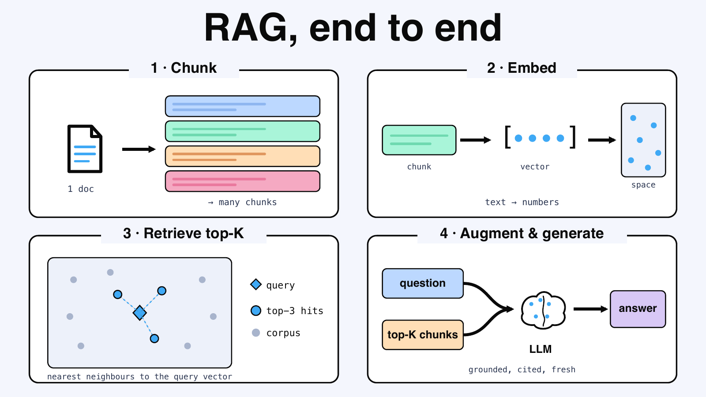
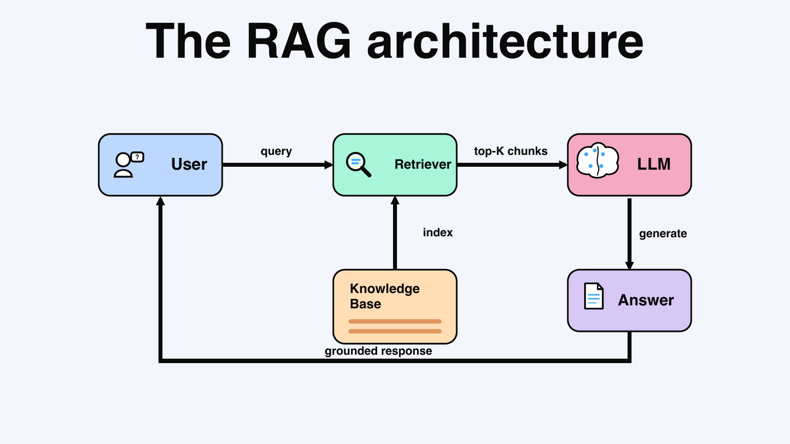

# Pangaea Labs — Claude Code Plugins Marketplace

A [Claude Code](https://claude.com/claude-code) plugin marketplace by
**[Pangaea Digital Labs](https://www.pangaea.id/)**.
Add it once, then install any plugin below.

## Add the marketplace

```bash
# from the Claude Code REPL
/plugin marketplace add labspangaea/pangaealabs-claude-plugins-marketplace
```

## Plugins

### `docsmith` — markdown → professional, on-brand PDFs

Generate polished, on-brand PDFs from markdown using design-system templates.
The `/make-pdf` skill picks one template and one company brand per run and fans a
single source out to one or more PDFs via parallel subagents. Every visual —
diagram, chart, or illustration — is hand-written raw SVG embedded inline (no d2,
Mermaid, or image generation).



**Templates**

- `handbook` — long-form report/guide as a LaTeX `book` (pandoc + tectonic)
- `corporate-deck` — 16:9 formal corporate / civic slides (marp-cli)
- `claudecode-deck` — 16:9 Claude/"claudecode"-branded slides (marp-cli)
- `kawaii-storybook` — 16:9 pastel storybook / NotebookLM-style deck (marp-cli)
- `concept-deck` — 16:9 tech-doc, **SVG-first** concept cards (ByteByteGo idiom): one full-canvas SVG per concept, near-white field, black-outlined pastel cards, black connectors, signal accent (marp-cli)

**Preview — one source, five looks** _(rendered demos from [`plugins/docsmith/examples/`](plugins/docsmith/examples/) — each a full per-class catalog with a footer logo; see each template's `CLASSES.md`)_

<table>
<tr>
<td width="50%"><br><sub><b>handbook</b> — LaTeX book · cover</sub></td>
<td width="50%"><br><sub>callouts + clickable links</sub></td>
</tr>
<tr>
<td><br><sub><b>corporate-deck</b> — formal slides · cover</sub></td>
<td><br><sub>KPI grid</sub></td>
</tr>
<tr>
<td><br><sub><b>claudecode-deck</b> — editorial · cover</sub></td>
<td><br><sub>dark statement slide</sub></td>
</tr>
<tr>
<td><br><sub><b>kawaii-storybook</b> — pastel storybook · cover</sub></td>
<td><br><sub>verdict path slide</sub></td>
</tr>
<tr>
<td><br><sub><b>concept-deck</b> — tech-doc, SVG-first · RAG end to end (multi-panel SVG)</sub></td>
<td><br><sub>RAG architecture · full-canvas SVG</sub></td>
</tr>
</table>

Layered config lives under `~/.docsmith/` (global profile + per-template overrides
+ per-doc front-matter), so the plugin location is portable. The one file to create
first is `~/.docsmith/profile.yaml` — it drives identity + branding for every PDF:

<details>
<summary><b>Example <code>~/.docsmith/profile.yaml</code></b> (made-up values — one entry per org you brand documents as)</summary>

```yaml
# ~/.docsmith/profile.yaml — one entry per org; one is picked per run by company
# name (or --company / front-matter). All values below are placeholders.
- company: "Acme Corp"
  author: "Jane Rivera"
  email: "press@acme.example"
  logo: ""                                  # optional: square SVG/PNG path; renders ~40px tall in footers
  wordmark: "ACME"                          # text fallback shown when no logo is set
  website: "https://acme.example"
  default_confidentiality: "Internal"       # Public / Internal / Confidential / Restricted; "" = none
  copyright: "© 2026 Acme Corp"

- company: "Nimbus Studio"
  author: "Lee Park"
  email: "hello@nimbus.example"
  logo: ""
  wordmark: "nimbus"
  website: "https://nimbus.example"
  default_confidentiality: ""
  copyright: "© 2026 Nimbus Studio"
```

Copy [`plugins/docsmith/examples/profile.example.yaml`](plugins/docsmith/examples/profile.example.yaml) to `~/.docsmith/profile.yaml` and edit.
</details>

```bash
# install
/plugin install docsmith@pangaealabs-claude-plugins-marketplace

# update later — refresh the catalog, then the plugin, then restart Claude Code
/plugin marketplace update pangaealabs-claude-plugins-marketplace
/plugin update docsmith@pangaealabs-claude-plugins-marketplace
```

Then, in any project:

```
/make-pdf turn report.md into a handbook PDF for Pangaea Labs
```

▸ **See every template's components rendered** — the flow diagram, a 4-template
gallery, and runnable demos with example prompts live in
**[the docsmith README](plugins/docsmith/README.md#gallery--every-templates-components-rendered)**
and **[`plugins/docsmith/examples/`](plugins/docsmith/examples/)**.

## Maintaining docsmith

_Repo-internal commands for maintainers — **not shipped to docsmith users** (end users get inline error help from `/make-pdf` while it builds)._

Two monitors in `plugins/docsmith/monitors/monitors.json` arm on `/make-pdf` and stream signal into the session:

| Monitor | Streams |
|---|---|
| `render-log` | tails `~/.docsmith/render.log` — one OK/FAIL line per build (`build.py` writes it) |
| `toolchain-doctor` | runs `doctor.py` at build start to flag a missing/broken toolchain (pandoc/tectonic/rsvg/marp/Chrome) — the **environment** failure class, caught before a render fails — then tails `~/.docsmith/toolchain.log` |

On a render failure, two commands form a detect → fix self-healing loop:

| Skill | Role | Triggered when |
|---|---|---|
| `docsmith-render-triage` | Reads the captured stderr from a FAIL, decides content bug vs docsmith infra bug | A render fails |
| `docsmith-fix-loop` | Fixes a confirmed skill/template/script finding, proves it with an eval + audit | Triage says it's an infra bug |

**Two evals — different things, often confused.** One tests *invocation*, the other *output*:

| Eval | Tests | Renders a PDF? | Eval set → harness |
|---|---|---|---|
| **Triggering** | does Claude *pick* `/make-pdf` for a prompt? | no | `dev/docsmith-workspace/trigger-evals.json` → skill-creator `run_loop.py` / `split_eval_set` (tunes the skill `description:`) |
| **Output / render** | is the produced PDF *correct* — page size, ≥1 image, no `d2` leak, expected text? | yes | `dev/make-pdf-workspace/evals.json` → `grade.py` / `grade_run.py` (writes `grading.json`) |

The **monitors** above are neither — they stream live build telemetry. See **[`CLAUDE.md`](CLAUDE.md)** for the full workflow and the optimizer gotchas (don't run the triggering eval in-place — the installed skill shadows it; it needs an isolated, authed, plugin-free config).

## License

© [Pangaea Digital Labs](https://www.pangaea.id/) — [www.pangaea.id](https://www.pangaea.id/)
