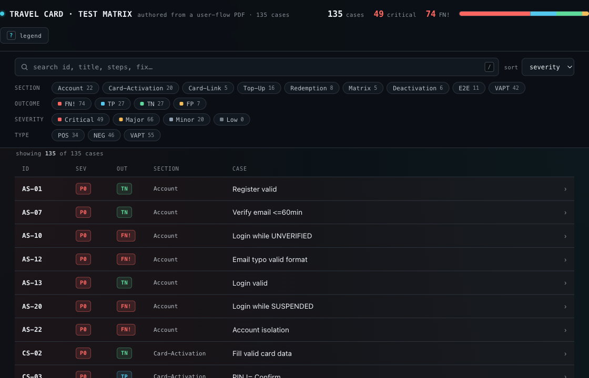

# Pangaea Labs — Claude Code Plugins Marketplace

A [Claude Code](https://claude.com/claude-code) plugin marketplace by
**[Pangaea Digital Labs](https://www.pangaea.id/)**. Add it once, then install any plugin below.

## Add the marketplace

```bash
# from the Claude Code REPL
/plugin marketplace add labspangaea/pangaealabs-claude-plugins-marketplace
```

Prefer another agent? An interactive `npx` installer puts these skills into **any** agent
(Claude Code, OpenClaw, Hermes, Cursor, Codex, OpenCode, Gemini CLI, Copilot, Warp, Zed, …):

```bash
npx github:labspangaea/pangaealabs-claude-plugins-marketplace
```

See **[docs/install.md](docs/install.md)** for the cross-agent flow, flags, and portability model.

## Plugins

### `docsmith` — markdown → professional, on-brand PDFs


Turn markdown into polished, on-brand PDFs across **5 design-system templates** — a LaTeX
`handbook` plus four 16:9 deck styles (`corporate-deck`, `claudecode-deck`, `kawaii-storybook`,
`concept-deck`). `/make-pdf` picks one template and one company brand per run; every diagram,
chart, and icon is hand-written raw SVG embedded inline (no d2, Mermaid, or image generation).

```bash
/plugin install docsmith@pangaealabs-claude-plugins-marketplace
```

▸ **Templates, the full rendered gallery, config & profile setup → [docsmith README](plugins/docsmith/README.md)**

### `testcraft` — user flows → test cases → offline console



Turn an app's **user flows** into a complete, importer-ready **test-case suite** and a single-file,
offline **HTML console**. Two chained skills — `/userflow-to-testcases` authors cases from a flow
doc (state machines → per-transition cases with downstream impact → matrix → E2E → VAPT), and
`/testcase-importer` normalizes any case data and renders the console — plus two subagents
(`testcase-architect`, `testcase-vapt-auditor`) for the heavy authoring and the security pass.

```bash
/plugin install testcraft@pangaealabs-claude-plugins-marketplace
```

▸ **The pipeline, canonical schema & bundled scripts → [testcraft README](plugins/testcraft/README.md)**

### `peruri-go-scaffolder` — scaffold production-ready Go services

Generate a complete Go service (`api` · `consumer` · `publisher`) wired to `go-peruri-lib` in one
pass — a hexagonal (ports & adapters) layout across **5 HTTP frameworks** (nethttp/gin/chi/mux/echo)
× 3 brokers (kafka/rabbitmq/redis) × postgres/mysql/none × redis/memory/couchbase/none. `/create-go-app`
orchestrates the per-layer skills and adds `cmd/`, `config/`, `go.mod`; API services ship OpenAPI 3.1 +
Stoplight Elements UI via huma v2. Requires the `go-lsp` MCP server (gopls) for post-write diagnostics.

```bash
/plugin install peruri-go-scaffolder@pangaealabs-claude-plugins-marketplace
```

▸ **Frameworks, the config store, lib auto-sync & runtime integration tests → [peruri-go-scaffolder README](plugins/peruri-go-scaffolder/README.md)**

### `peruri-elysia-scaffolder` — scaffold production-ready ElysiaJS/Bun services

The TypeScript/Bun counterpart of `peruri-go-scaffolder`, wired to `@peruri/ts-lib`. Generates domain
types, ports, Drizzle repositories (optional caching), services, and TypeBox HTTP controllers across
Drizzle (postgres/mysql/none) × cache (redis/memory/couchbase/none) × broker (kafka/rabbitmq/redis).
API services ship OpenAPI 3.1 + Scalar UI via `@elysiajs/openapi` and a tree-shaken `SERVICE_BACKEND=stub`
mode so frontends can integrate against the contract before backend logic is finalized.

```bash
/plugin install peruri-elysia-scaffolder@pangaealabs-claude-plugins-marketplace
```

▸ **Parameters, stub mode, hexagonal architecture & the config store → [peruri-elysia-scaffolder README](plugins/peruri-elysia-scaffolder/README.md)**

---

_Maintaining a plugin in this repo? See **[CLAUDE.md](CLAUDE.md)** (monitors, evals, the release
command, and the optimizer gotchas)._

## License

© [Pangaea Digital Labs](https://www.pangaea.id/) — [www.pangaea.id](https://www.pangaea.id/)
