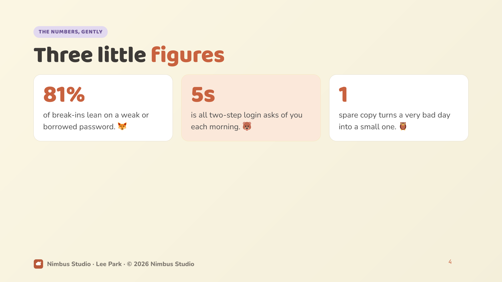

# Pangaea Labs — Claude Code Plugins Marketplace

A [Claude Code](https://claude.com/claude-code) plugin marketplace by **Pangaea Labs**.
Add it once, then install any plugin below.

## Add the marketplace

```bash
# from the Claude Code REPL
/plugin marketplace add labspangaea/pangaealabs-claude-plugins-marketplace
```

## Plugins

### `docsmith` — markdown → professional, on-brand PDFs

Generate polished, on-brand PDFs from markdown using design-system templates.
The `/make-pdf` skill picks one template and one company brand per run and fans a
single source out to one or more PDFs via parallel subagents. Every visual —
diagram, chart, or illustration — is hand-written raw SVG embedded inline (no d2,
Mermaid, or image generation).


**Templates**

- `handbook` — long-form report/guide as a LaTeX `book` (pandoc + tectonic)
- `corporate-deck` — 16:9 formal corporate / civic slides (marp-cli)
- `claudecode-deck` — 16:9 Claude/"claudecode"-branded slides (marp-cli)
- `kawaii-storybook` — 16:9 pastel storybook / NotebookLM-style deck (marp-cli)

**Preview — one source, four looks** _(rendered demos from [`plugins/docsmith/examples/`](plugins/docsmith/examples/))_

<table>
<tr>
<td width="50%"><br><sub><b>handbook</b> — LaTeX book · cover</sub></td>
<td width="50%"><br><sub>callouts + clickable links</sub></td>
</tr>
<tr>
<td><br><sub><b>corporate-deck</b> — formal slides · cover</sub></td>
<td><br><sub>KPI grid</sub></td>
</tr>
<tr>
<td><br><sub><b>claudecode-deck</b> — editorial · cover</sub></td>
<td><br><sub>dark statement slide</sub></td>
</tr>
<tr>
<td><br><sub><b>kawaii-storybook</b> — pastel storybook · cover</sub></td>
<td><br><sub>verdict path slide</sub></td>
</tr>
</table>

Layered config lives under `~/.docsmith/` (global profile + per-template overrides
+ per-doc front-matter), so the plugin location is portable.

```bash
/plugin install docsmith@pangaealabs-claude-plugins-marketplace
```

Then, in any project:

```
/make-pdf turn report.md into a handbook PDF for Pangaea Labs
```

▸ **See every template's components rendered** — the flow diagram, a 4-template
gallery, and runnable demos with example prompts live in
**[the docsmith README](plugins/docsmith/README.md#gallery--every-templates-components-rendered)**
and **[`plugins/docsmith/examples/`](plugins/docsmith/examples/)**.

## License

© Pangaea Labs.
