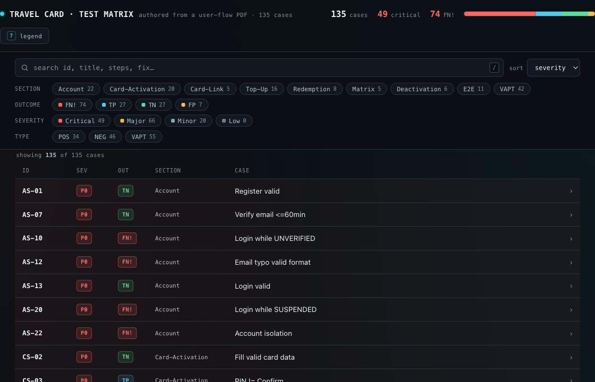

# Pangaea Labs — Claude Code Plugins Marketplace

A [Claude Code](https://claude.com/claude-code) plugin marketplace by
**[Pangaea Digital Labs](https://www.pangaea.id/)** — **5 plugins, 14 skills, 3 subagents** across
document production, QA test design, graphic-design review, and backend service scaffolding.
Add the marketplace once, then install whichever you need.

## Add the marketplace

```bash
# from the Claude Code REPL
/plugin marketplace add labspangaea/pangaealabs-claude-plugins-marketplace
```

Prefer another agent? An interactive `npx` installer puts these skills into **any** agent
(Claude Code, OpenClaw, Hermes, Cursor, Codex, OpenCode, Gemini CLI, Copilot, Warp, Zed, …):

```bash
npx github:labspangaea/pangaealabs-claude-plugins-marketplace
```

See **[docs/install.md](docs/install.md)** for the cross-agent flow, flags, and portability model.

## Plugins

| Plugin | What it gives you | Skills | Needs |
|---|---|---|---|
| **[`docsmith`](#docsmith--markdown--professional-on-brand-pdfs)** | markdown → on-brand PDFs across 5 design-system templates | 1 + 1 agent | pandoc · tectonic · marp-cli · rsvg · Chrome |
| **[`testcraft`](#testcraft--user-flows--test-cases--offline-console)** | user flows → importer-ready test-case suite + offline HTML console | 2 + 2 agents | python3 |
| **[`dkv`](#dkv--graphic-design-fundamentals-as-a-review-method)** | design critique & direction for print and static graphics | 1 | python3 *(optional)* |
| **[`go-scaffolder`](#go-scaffolder--scaffold-production-ready-go-services)** | production-ready Go services, hexagonal, 5 HTTP frameworks | 5 | Go 1.26+ · `go-lsp` MCP |
| **[`elysia-scaffolder`](#elysia-scaffolder--scaffold-production-ready-elysiajsbun-services)** | the ElysiaJS/Bun counterpart, wired to `@labspangaea/ts-lib` | 5 | Bun 1.1+ · `ts-lsp` MCP |

Each is independent — install one or all five. The `npx` installer warns about a missing toolchain
but never blocks; only the scaffolders hard-require theirs.

### `docsmith` — markdown → professional, on-brand PDFs


Turn markdown into polished, on-brand PDFs across **5 design-system templates** — a LaTeX
`handbook` plus four 16:9 deck styles (`corporate-deck`, `claudecode-deck`, `kawaii-storybook`,
`concept-deck`). `/make-pdf` picks one template and one company brand per run; every diagram,
chart, and icon is hand-written raw SVG embedded inline (no d2, Mermaid, or image generation).

```bash
/plugin install docsmith@pangaealabs-claude-plugins-marketplace
```

▸ **Templates, the full rendered gallery, config & profile setup → [docsmith README](plugins/docsmith/README.md)**

### `testcraft` — user flows → test cases → offline console



Turn an app's **user flows** into a complete, importer-ready **test-case suite** and a single-file,
offline **HTML console**. Two chained skills — `/userflow-to-testcases` authors cases from a flow
doc (state machines → per-transition cases with downstream impact → matrix → E2E → VAPT), and
`/testcase-importer` normalizes any case data and renders the console — plus two subagents
(`testcase-architect`, `testcase-vapt-auditor`) for the heavy authoring and the security pass.

```bash
/plugin install testcraft@pangaealabs-claude-plugins-marketplace
```

▸ **The pipeline, canonical schema & bundled scripts → [testcraft README](plugins/testcraft/README.md)**

### `dkv` — graphic-design fundamentals as a review method

Critique an existing design or direct a new one, across **colour, typography, layout, grid, and
Gestalt**. `/design-fundamentals` either runs a structured review pass over a poster / packaging /
menu / logo / deck and reports impact-ranked fixes with a severity each, or turns a brief into a
buildable spec — palette with hex + 60/30/10 + **measured contrast ratios**, a type pairing on a
modular scale, and a grid strategy. Validated against the literature rather than assembled from
received wisdom: it carries the numbers most design advice omits (WCAG floors for text **and**
non-text, the 45–75 character measure, the 8pt grid) and flags the folklore — the golden ratio as a
law of beauty, Baker-Miller pink, the 80% brand-recognition figure — instead of repeating it.
Scoped to **print and static graphics**; websites and app UI stay with `impeccable` /
`frontend-design`.

```bash
/plugin install dkv@pangaealabs-claude-plugins-marketplace
```

▸ **The five reference files, the contested claims & sourcing → [dkv README](plugins/dkv/README.md)**

### `go-scaffolder` — scaffold production-ready Go services

Generate a complete Go service (`api` · `consumer` · `publisher`) wired to `go-lib` in one
pass — a hexagonal (ports & adapters) layout across **5 HTTP frameworks** (nethttp/gin/chi/mux/echo)
× 3 brokers (kafka/rabbitmq/redis) × postgres/mysql/none × redis/memory/couchbase/none. `/create-go-app`
orchestrates the per-layer skills and adds `cmd/`, `config/`, `go.mod`; API services ship OpenAPI 3.1 +
Stoplight Elements UI via huma v2. Requires the `go-lsp` MCP server (gopls) for post-write diagnostics.

```bash
/plugin install go-scaffolder@pangaealabs-claude-plugins-marketplace
```

▸ **Frameworks, the config store, lib auto-sync & runtime integration tests → [go-scaffolder README](plugins/go-scaffolder/README.md)**

### `elysia-scaffolder` — scaffold production-ready ElysiaJS/Bun services

The TypeScript/Bun counterpart of `go-scaffolder`, wired to `@labspangaea/ts-lib`. Generates domain
types, ports, Drizzle repositories (optional caching), services, and TypeBox HTTP controllers across
Drizzle (postgres/mysql/none) × cache (redis/memory/couchbase/none) × broker (kafka/rabbitmq/redis).
API services ship OpenAPI 3.1 + Scalar UI via `@elysiajs/openapi` and a tree-shaken `SERVICE_BACKEND=stub`
mode so frontends can integrate against the contract before backend logic is finalized.

```bash
/plugin install elysia-scaffolder@pangaealabs-claude-plugins-marketplace
```

▸ **Parameters, stub mode, hexagonal architecture & the config store → [elysia-scaffolder README](plugins/elysia-scaffolder/README.md)**

---

_Maintaining a plugin in this repo? See **[CLAUDE.md](CLAUDE.md)** — the layout, docsmith's
background monitors, the three signal systems (monitors vs triggering eval vs output eval, routinely
confused), the release command, and the triggering-eval isolation traps that produce confidently
wrong numbers if you skip them._

## License

© [Pangaea Digital Labs](https://www.pangaea.id/) — [www.pangaea.id](https://www.pangaea.id/)
