# docsmith

Turn markdown into professional, on-brand PDFs across **design-system templates**.
One source can fan out to several templates at once. Diagrams and art are
**hand-written raw SVG** embedded as markdown images (no d2/Mermaid/image-gen) —
the handbook converts them to PDF via rsvg-convert, the decks embed them via
Chrome. **PDF only.**

## How it works


One markdown source + one org profile → the `/make-pdf` skill picks a template and
brand, authors any visuals as raw SVG, and `build.py` composes the chosen design
system into a finished PDF. The look is the template's; the brand is your profile's.

## Templates
| Template | Backend | Look |
|---|---|---|
| `handbook` | pandoc + tectonic | LaTeX **book** (6.5×9.25in), navy palette, callout cards, dotted-leader TOC. From `ai-roadmap.pdf`. |
| `corporate-deck` | marp-cli | 16:9 **slides**, formal corporate / civic deck (navy/green/gold, serif Lora accents). Brand per company via the docsmith profile; default look derived from a government design system. |
| `claudecode-deck` | marp-cli | 16:9 **slides**, Claude editorial (cream/clay, Instrument Serif + Manrope + JetBrains Mono). |
| `kawaii-storybook` | marp-cli | 16:9 **slides**, soft pastel storybook / NotebookLM (rotating washes, chip-cards, verdict pills, emoji + hand-drawn SVG heroes, full-bleed SVG scenes, callouts, code blocks; Baloo 2 + Nunito + Lora). From `The_Secure_Cloud_Village.pdf`. |

## Gallery — every template's components, rendered

Each template ships a runnable demo under [`examples/`](examples/) that renders
**every** slide class / callout component, so each PDF doubles as a visual catalog —
and each folder has a `CLASSES.md` listing every class with its page. Demos render
with the made-up [`examples/profile.example.yaml`](examples/profile.example.yaml),
including its **footer logo** (hand-written SVG under [`examples/logo/`](examples/logo/)).

### `handbook` — *The Async Team Handbook* (Acme Corp) · 11 pp
<table>
<tr>
<td width="50%">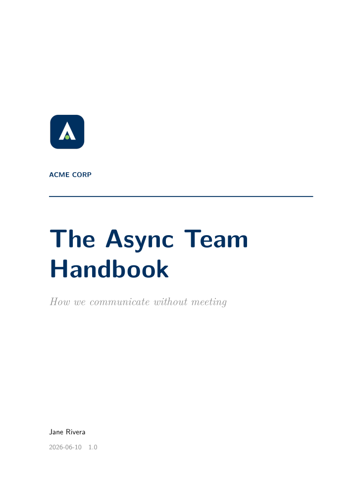<br><sub><b>Cover</b> — title page + Acme logo</sub></td>
<td width="50%">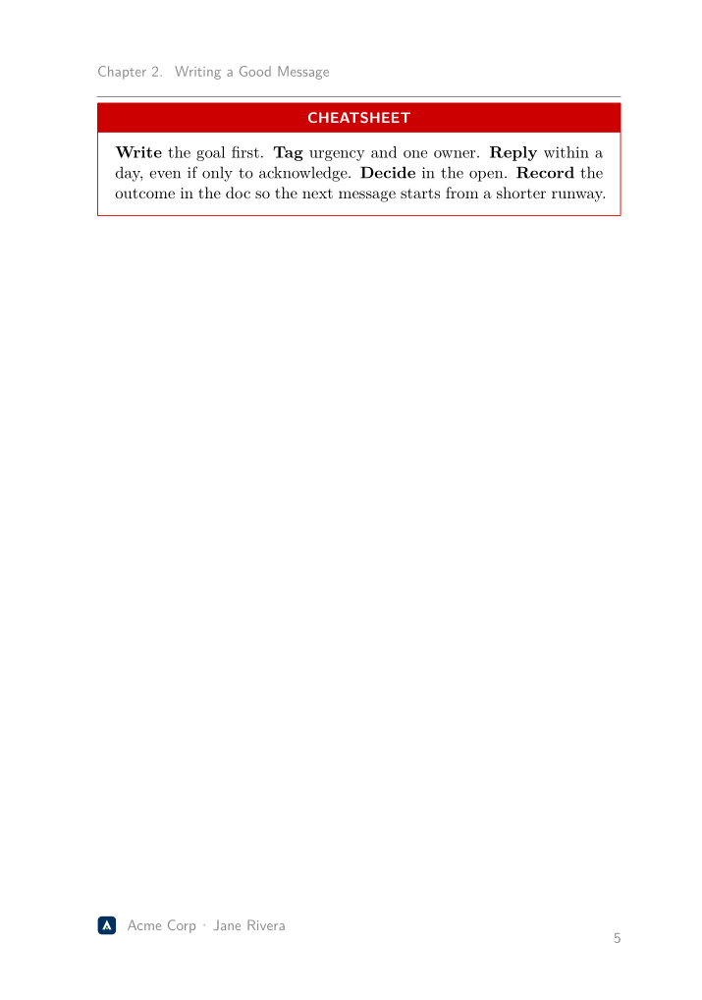<br><sub><b>Callouts</b> — do / don't / cheatsheet</sub></td>
</tr>
<tr>
<td>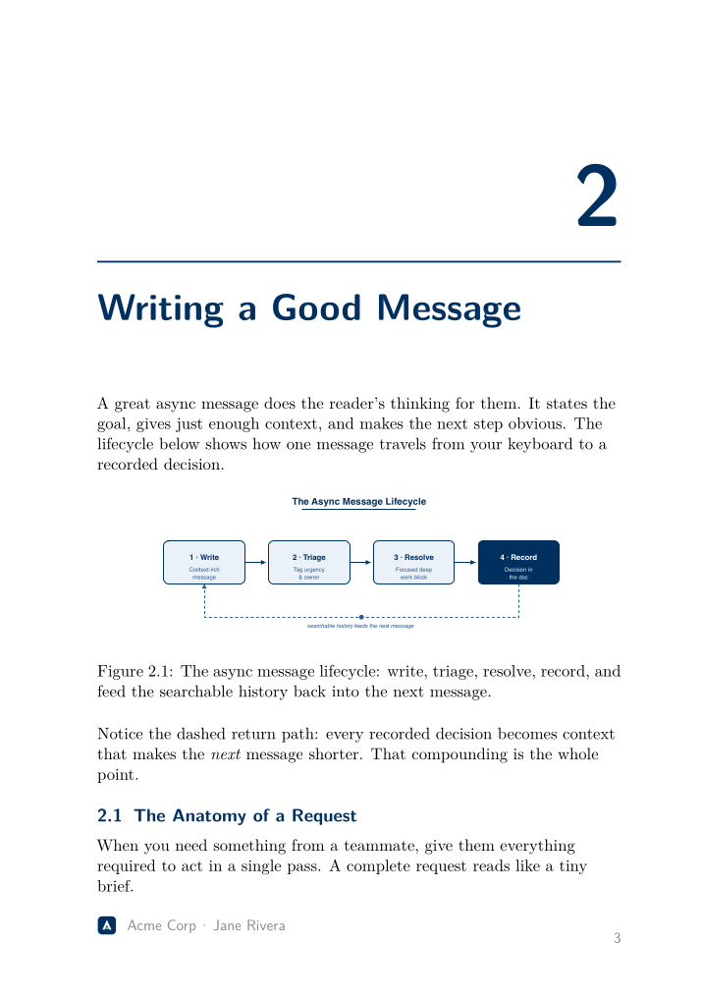<br><sub><b>Diagram</b> — hand-written raw SVG, SVG→PDF</sub></td>
<td>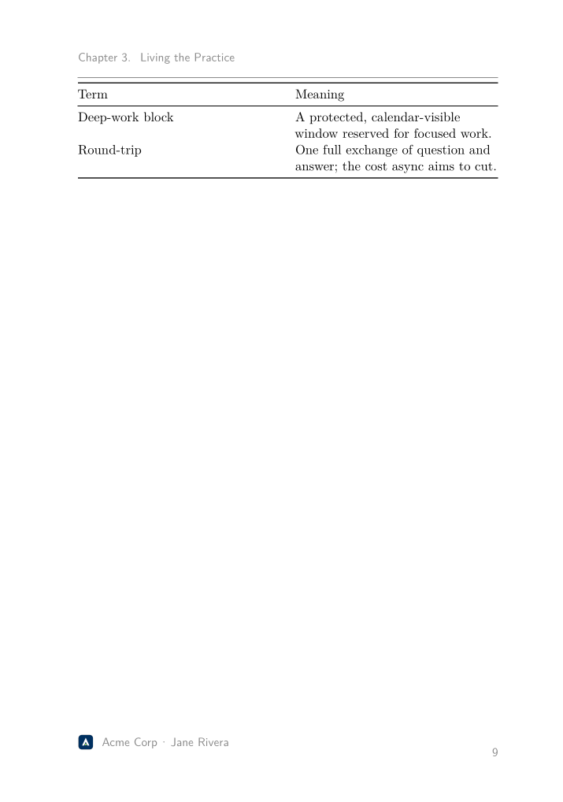<br><sub><b>Glossary</b> — two-column term table</sub></td>
</tr>
</table>

> **Try it:** `Turn examples/handbook/async-handbook.md into a handbook PDF for Acme Corp`
> 📋 **All components →** [`examples/handbook/CLASSES.md`](examples/handbook/CLASSES.md) · folder [`examples/handbook/`](examples/handbook/)

### `corporate-deck` — *FY26 Strategy Review* (Acme Corp) · 19 slides
<table>
<tr>
<td width="50%">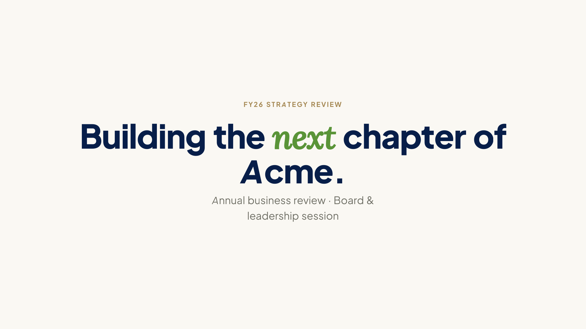<br><sub><b>cover</b></sub></td>
<td width="50%">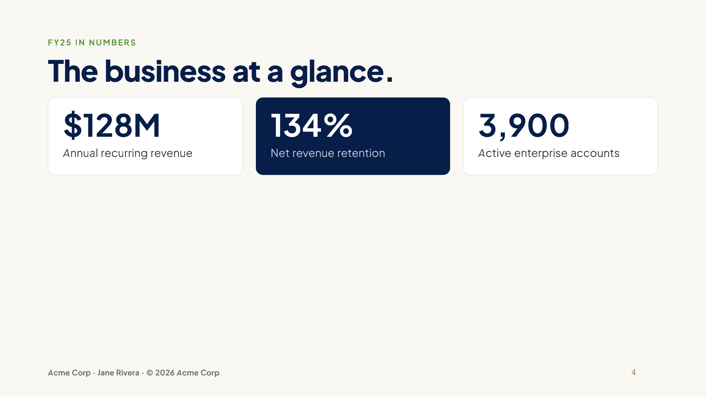<br><sub><b>kpi</b> — metric grid</sub></td>
</tr>
<tr>
<td>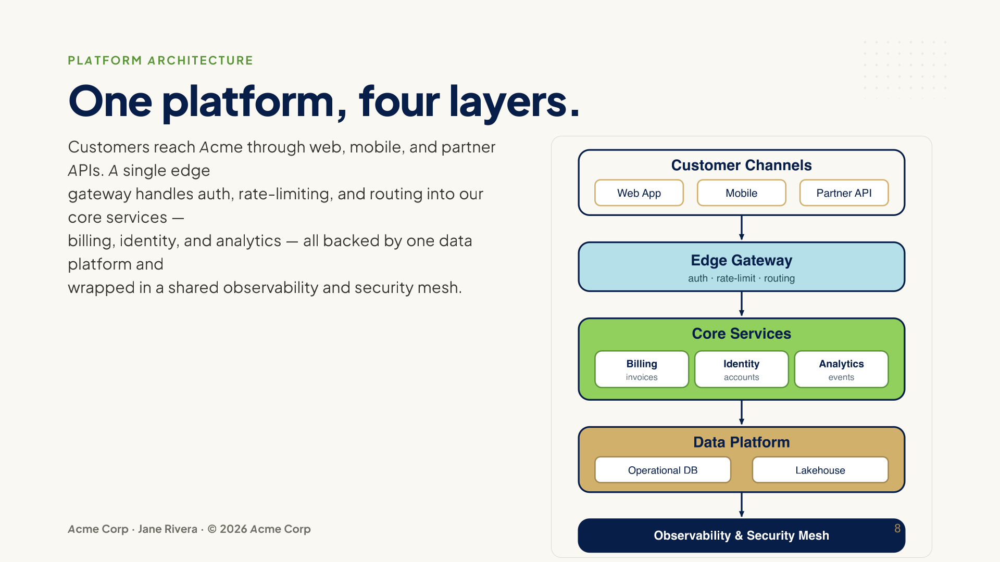<br><sub><b>split</b> — SVG figure, no box/card</sub></td>
<td>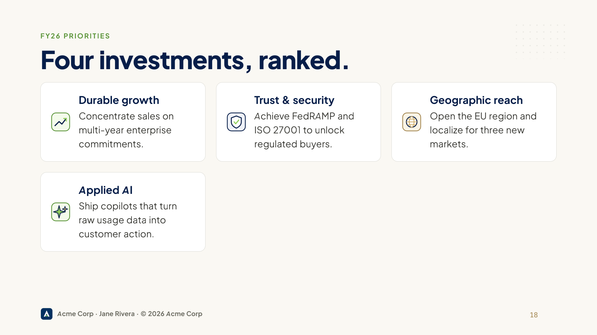<br><sub><b>iconcards</b> — SVG icons + titles</sub></td>
</tr>
</table>

> **Try it:** `Make a corporate-deck from examples/corporate-deck/acme-qbr.md, brand Acme Corp`
> 📋 **All 19 classes →** [`examples/corporate-deck/CLASSES.md`](examples/corporate-deck/CLASSES.md) · folder [`examples/corporate-deck/`](examples/corporate-deck/)
> 🅰️ The footer shows the **Acme logo** — hand-written SVG ([`examples/logo/acme.svg`](examples/logo/acme.svg)), set via the profile's `logo:`.

### `claudecode-deck` — *Nimbus — Product Launch* (Nimbus Studio) · 22 slides
<table>
<tr>
<td width="50%">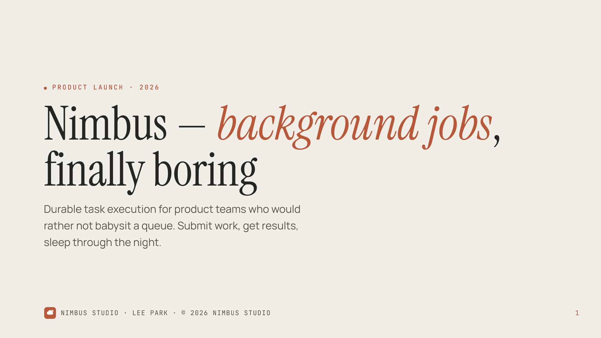<br><sub><b>cover</b> — editorial serif + clay accent</sub></td>
<td width="50%">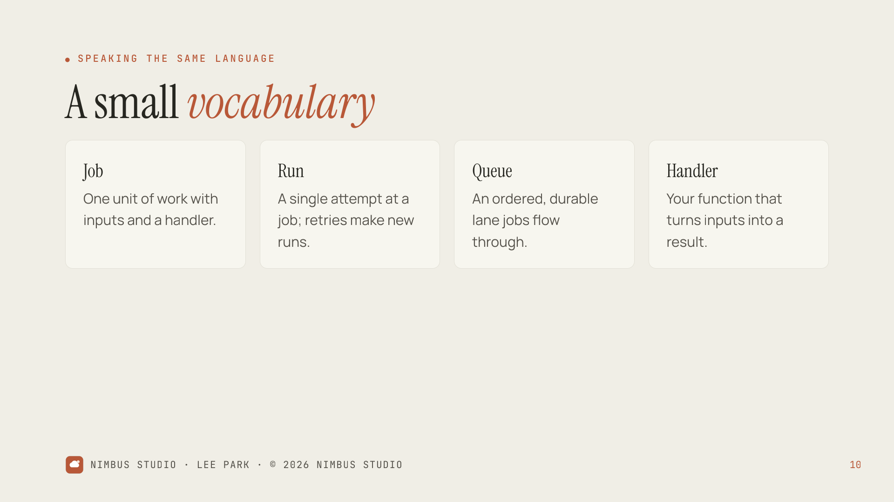<br><sub><b>glossary</b> — hairline cards</sub></td>
</tr>
<tr>
<td>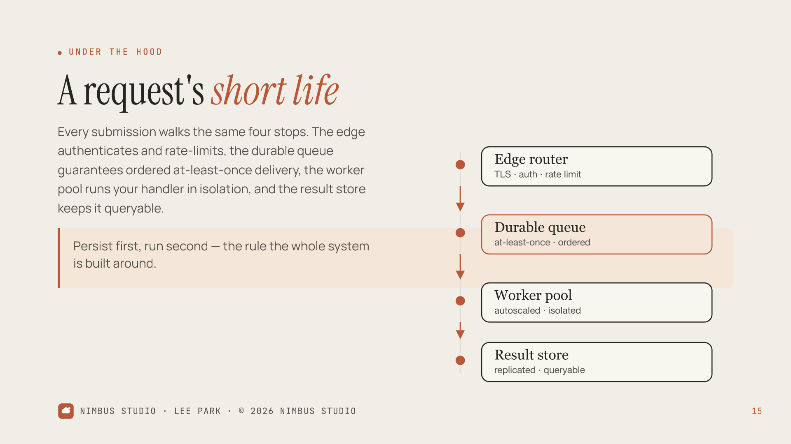<br><sub><b>split</b> — transparent SVG on the cream wash</sub></td>
<td>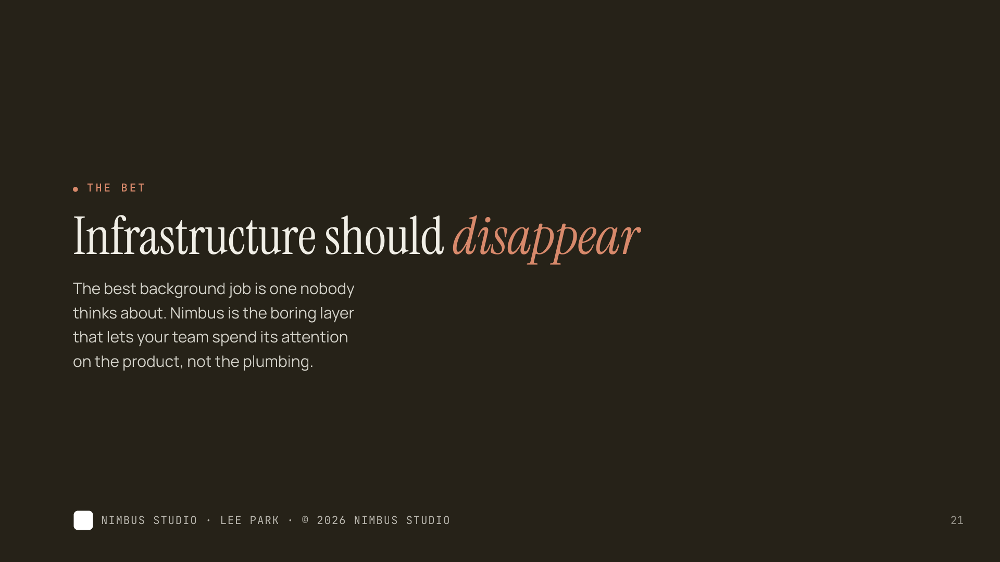<br><sub><b>statement</b> — dark espresso slide</sub></td>
</tr>
</table>

> **Try it:** `Render examples/claudecode-deck/nimbus-launch.md to claudecode-deck`
> 📋 **All 22 classes →** [`examples/claudecode-deck/CLASSES.md`](examples/claudecode-deck/CLASSES.md) · folder [`examples/claudecode-deck/`](examples/claudecode-deck/)

### `kawaii-storybook` — *Cloud Safety, Explained* (Nimbus Studio) · 28 pp
<table>
<tr>
<td width="50%">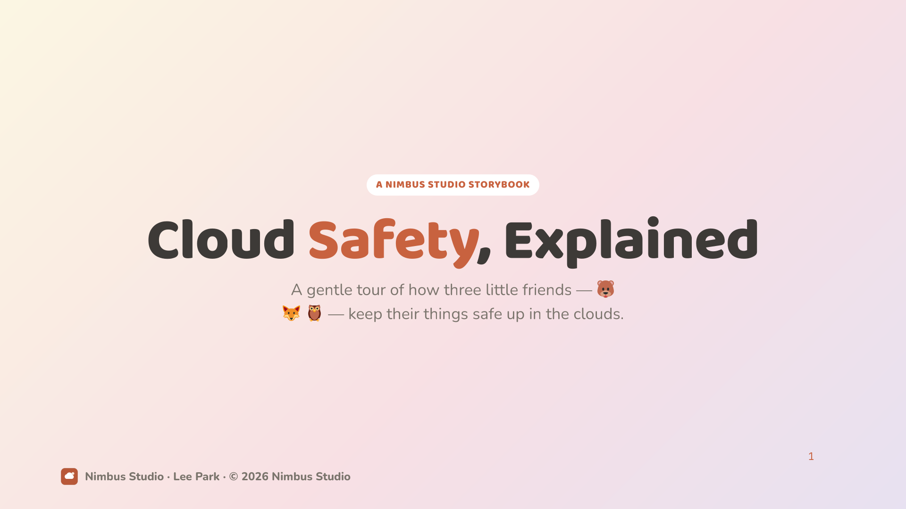<br><sub><b>cover</b> — pastel wash + emoji mascots</sub></td>
<td width="50%">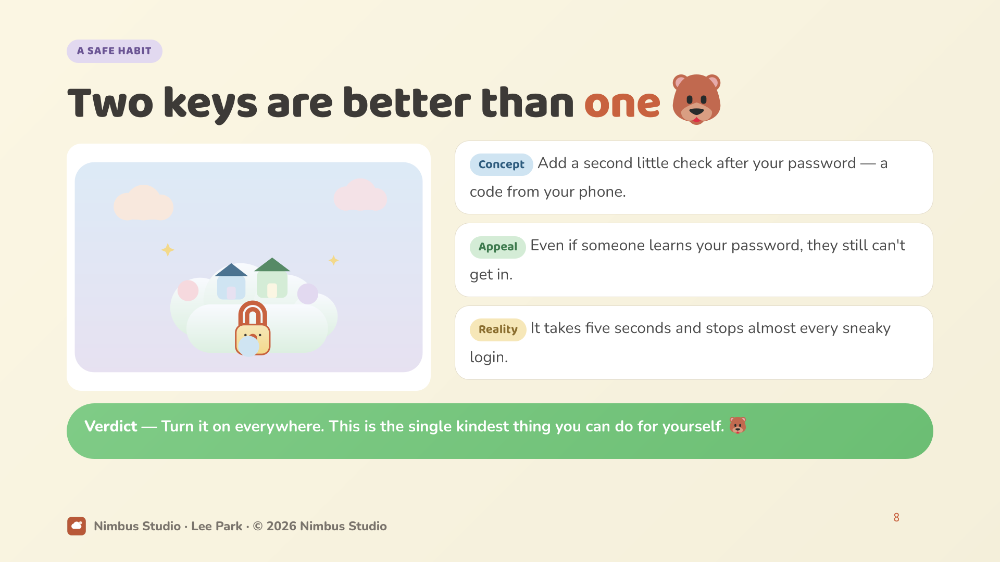<br><sub><b>path</b> — hero + green verdict pill</sub></td>
</tr>
<tr>
<td>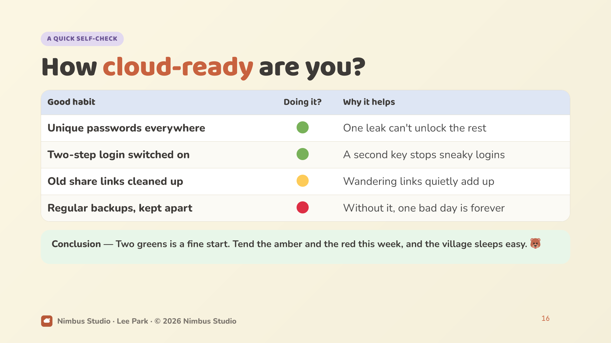<br><sub><b>scorecard</b> — 🟢🟡🔴 matrix</sub></td>
<td>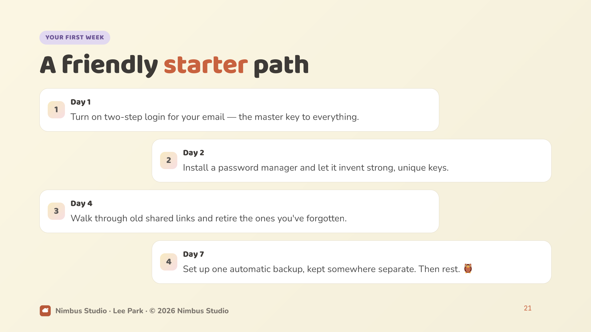<br><sub><b>roadmap</b> — zig-zag signposts</sub></td>
</tr>
</table>

> **Try it:** `Make a cute kawaii-storybook from examples/kawaii-storybook/cloud-safety.md`
> 📋 **All 24 classes →** [`examples/kawaii-storybook/CLASSES.md`](examples/kawaii-storybook/CLASSES.md) · folder [`examples/kawaii-storybook/`](examples/kawaii-storybook/)

## Use it
Invoke the **`/docsmith:make-pdf`** skill (or just ask Claude to "make a PDF /
handbook / deck"). It checks tooling, asks which template to render, then builds
it (embedding any hand-written SVG diagrams/art directly).

Or run the scripts directly:
```bash
python3 scripts/doctor.py
python3 scripts/build.py --in DOC.md --out DOC.pdf --template corporate-deck
```

## Config (`~/.docsmith/`)
- `profile.yaml` — global identity/branding (a YAML **list of org objects**; one is
  picked per run by company name, or via `--company` / front-matter).
- `template/<name>.yaml` — per-template token overrides.
- per-document front-matter `overrides:` — one-off tweaks.

A profile is one entry per org you brand documents as. Example (made-up values —
copy [`examples/profile.example.yaml`](examples/profile.example.yaml) to
`~/.docsmith/profile.yaml` and edit):

```yaml
# ~/.docsmith/profile.yaml — one entry per org you brand documents as.
- company: "Acme Corp"
  author: "Jane Rivera"
  email: "press@acme.example"
  logo: ""                                  # optional: square SVG/PNG path (e.g. examples/logo/acme.svg); renders ~40px tall in footers
  wordmark: "ACME"                          # text fallback shown when no logo is set
  website: "https://acme.example"
  default_confidentiality: "Internal"       # Public / Internal / Confidential / Restricted; "" = none
  copyright: "© 2026 Acme Corp"

- company: "Nimbus Studio"
  author: "Lee Park"
  email: "hello@nimbus.example"
  logo: ""
  wordmark: "nimbus"
  website: "https://nimbus.example"
  default_confidentiality: ""
  copyright: "© 2026 Nimbus Studio"
```

## Requirements
`pandoc`, `tectonic`, `rsvg-convert` (SVG validation + handbook SVG→PDF),
`poppler` (pdfinfo/pdftotext), Node/`npx` (for marp-cli), and a headless Chrome.
Run `scripts/doctor.py`.

## Authoring & extending
See `references/authoring-guide.md` and `references/adding-a-template.md`. Each
template's design system is documented in `assets/templates/<name>/design-system.md`.
