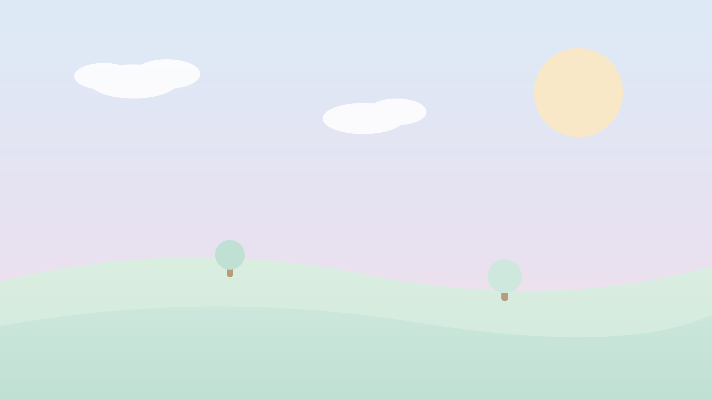

<!-- _class: cover -->

###### docsmith · kawaii-storybook

# A *cozy* tour of the deck. 🐻

Pastel washes, puffy cards, chip labels, and verdict pills.

---

<!-- _class: laws -->

# Four little rules.

- **Soft washes** Every slide gets its own pastel gradient, cycled automatically.
- **Puffy cards** Lists become rounded cards with gentle shadows.
- **Chip labels** Each card's **bold** lead turns into a pastel chip.
- **Emoji mascots** Drop 🦊🦉🐹 inline — in a heading they grow into heroes.

---

<!-- _class: flow -->

###### How a render flows

# From markdown to a cozy PDF.

- **Write** one markdown source with `<!-- _class -->` directives.
- **Render** diagrams once, shared across templates.
- **Build** marp turns it into 16:9 slides.
- **Ship** a 1440×810pt PDF. 🎉

---

<!-- _class: path accept -->

# Path: pick a template. 🦊

- **The Concept** One source fans out to any docsmith template.
- **The Appeal** Zero copy-paste; the design system does the work.
- **The Reality** Pick a class per slide; emoji and chips come for free.

> ✅ Verdict: the strongest default for cute, readable decks.

---

<!-- _class: path reject -->

# Path: restyle every doc by hand. 🐹

- **The Concept** Re-do colors, fonts, and spacing for each document.
- **The Appeal** Total control over every pixel.
- **The Reality** Drift, inconsistency, and hours lost per report.

> ❌ Verdict: rejected. The maintenance cost is brutal.

---

<!-- _class: scorecard -->

# The little scorecard.

| Axis | By hand | docsmith |
|---|---|---|
| Consistency | 🔴 | 🟢 |
| Speed | 🟡 | 🟢 |
| Fun | 🟡 | 🟢 |

> Clear winner: one design system, many cozy PDFs.

---

<!-- _class: scenarios -->

# When things change.

- **New brand color** → **Edit one token** → **Every slide updates**
- **New slide type** → **Add a class** → **Available everywhere**
- **New template** → **Drop a folder** → **Shows up in the picker**

---

<!-- _class: figure -->

# 🦉

A big emoji makes a perfectly good hero — no raster art required.

---

<!-- The make-pdf skill embeds SVG by ABSOLUTE path (the build runs from a temp
     dir). These samples use repo-relative paths to stay portable. -->

<!-- _class: figure bare -->

###### or hand-draw one

# Meet *Bara*. 


When emoji won't do, a hand-written SVG character is the hero — same flow as a handbook diagram, just pastel. Give the SVG `width`+`height` so it doesn't collapse.

---



###### full-bleed scene

# A *storybook* backdrop.

A hand-written SVG paints the whole slide via marp's `![bg]` directive — `cover`, `right:40%`, or `opacity` to keep text readable.

---

# Little notes that *pop*.

<aside class="callout tip">

**Pro tip** — validate every SVG with `rsvg-convert` before you embed it.

</aside>

<aside class="callout warning">

**Watch out** — use absolute paths; the build runs from a temp dir.

</aside>

<aside class="callout plain">

**In plain English** — leave a blank line inside the aside so the markdown renders.

</aside>

---

# Build it in *one line*.

```bash
python3 scripts/build.py \
  --in deck.md --out deck.pdf \
  --template kawaii-storybook
```

Fenced blocks get a soft card with a violet spine; inline `code` stays an amber chip.

---

<!-- _class: quote -->

> Good design is **shared**, not redone for every document.

---

<!-- _class: roadmap -->

# A tiny roadmap.

- **Sketch** the outline in plain markdown.
- **Tag** each slide with a layout class.
- **Render** to PDF and admire the pastels.
- **Reuse** the same source in any other template.

---

<!-- _class: closing -->

###### thank you

# Build it once. *Reuse it everywhere.* 🐻🦊🦉🐹

docsmith · kawaii-storybook
